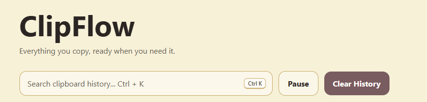
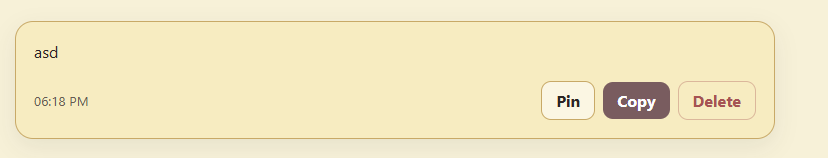
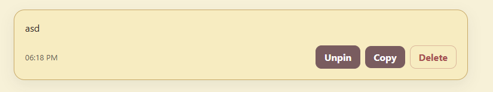
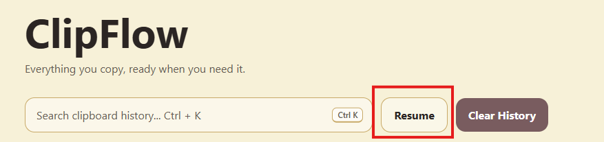

# ClipFlow

https://qu.ax/x/SjaYs.mp4 (Quick showcase of ClipFlow)

ClipFlow is a lightweight desktop clipboard history manager built with Electron.

It automatically stores copied text locally so you can search, reuse, pin, and manage previous clipboard entries without repeatedly reopening files, websites, or messages.

## Features

- Automatic clipboard history
- Persistent local storage
- Instant search with `Ctrl + K`
- One-click copy
- Pin reusable entries
- Delete individual entries
- Clear unpinned history
- Pause and resume clipboard recording
- Duplicate prevention
- Clean, minimal desktop interface

## Why ClipFlow?

Copying new text normally replaces whatever was previously stored in your clipboard.

ClipFlow removes that friction by keeping a searchable history of copied text. This is useful for links, commands, code snippets, email addresses, messages, and anything else you regularly reuse.

All clipboard history is stored locally on your device.

## Keyboard Shortcuts

| Shortcut | Action |
|---|---|
| `Ctrl + K` | Focus clipboard search |
| `Escape` | Clear and close search |

On macOS, use `Cmd + K`.

## Tech Stack

- Electron
- JavaScript
- HTML
- CSS
- electron-store
- electron-builder

## Installation

### Requirements

- Node.js
- npm

Clone the repository:

```bash
git clone https://github.com/nyxynt/clipflow.git
cd clipflow
```

Install dependencies:

```bash
npm install
```

Start the application:

```bash
npm start
```

## Building the Application

Create a packaged Windows installer:

```bash
npm run build
```

The generated files will appear in:

```text
dist/
```

## Project Structure

```text
clipflow/
├── build/
│   └── icon.png
├── src/
│   ├── index.html
│   ├── renderer.js
│   └── styles.css
├── main.js
├── preload.cjs
├── package.json
└── README.md
```

## How It Works

ClipFlow checks the system clipboard for new text.

When a new value is detected, it:

1. Removes unnecessary whitespace.
2. Checks whether the value already exists in history.
3. Adds or moves the entry to the top.
4. Saves the updated history locally.
5. Updates the interface.

The renderer does not access Electron or Node.js APIs directly. Clipboard and storage operations are exposed through a limited preload bridge.

## Privacy

ClipFlow does not require an account and does not upload clipboard data. (I don't steal data :) ) 

Clipboard history is stored locally using `electron-store` library.

Use the **Pause** button before copying passwords, private messages, authentication tokens, or other sensitive information.

## Main Quality-of-Life Improvements

### Searchable Clipboard History

Previously copied text can be recovered instantly instead of being permanently overwritten.



### Pinned Snippets

Frequently reused entries can remain at the top and survive history clearing.

(Not pinned)

(Pinned)

### Pause Recording

Clipboard monitoring can be temporarily disabled when handling sensitive content.



## Development

Run the application:

```bash
npm start
```

Build the installer:

```bash
npm run build
```

## Limitations

- ClipFlow currently records text clipboard content only.
- Clipboard history is stored locally on one device.
- Images and files are not currently supported.
- Sensitive clipboard content must be managed using the pause feature.

## Future Improvements

- Configurable history limits
- Content-type detection
- URL opening
- Relative timestamps
- Long-entry expansion
- System tray support

## License

This project is licensed under the GNU AGPL V3 License (See LICENSE for more info)